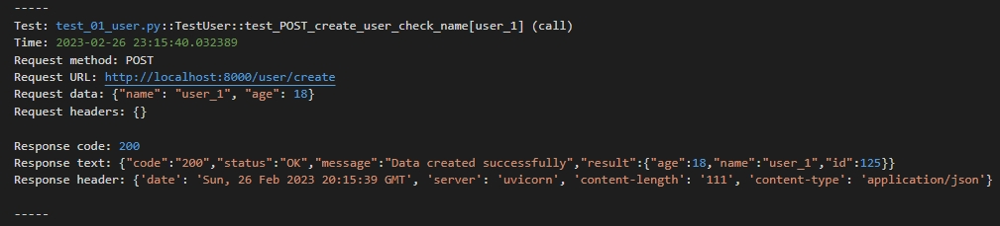

# Autotests
# Basic template-framework for API testing using pytest, requests, jsonschema

Default host is http://localhost:8000

For changing default host use environment variable 'HOST' (see environment.py)\
For example on windows: $Env:ENV = 'http://yourhost.com/api'

Make jsonschema of tested route, copy file to /shemas directory.\
Write you testing code using template test_01_user.py\
Run test by 'pytest' command\
After pytest runnig logs are available in /logs directory.
